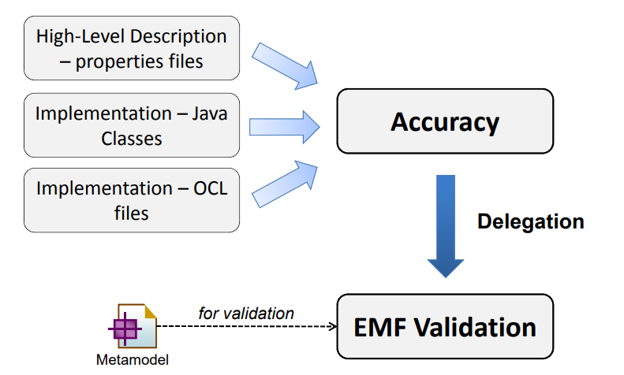
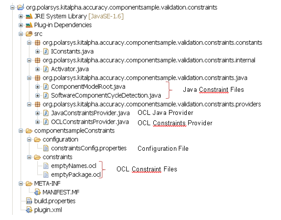

# Accuracy
## Objectives
This project defines architecture to contribute and define easily OCL or JAVA Constraints for any EMF Modeling project. Accuracy uses is based on the EMF Validation Framework and Eclipse architecture profits by exploiting the concept of plug-in.



## Extensibility
Accuracy is an Eclipse plug-in that uses some kind files and defined an extension point. 
There are three important kinds of files: 
* The configuration file: provides some information like, the severity level, message, etc. for your invariants in this file.
* The OCL files: you put the OCL Constraints in those files.
* The Java files: Each class checks one validation rule.

Here is an organization sample: 



### Declaring Validation Rules
#### The Ocl File
An OCL file contains one or more invariants (at your convenience).

```
constraint0001.ocl:
package extlibrary
context Library
-- we can define additional operations and attributes to assist
-- in the formulation of our constraints
def: unpublishedWriters : Set(Writer) = self.writers->select(books->isEmpty())

-- so, here we use one such definition
inv writers_have_written: unpublishedWriters->isEmpty()
endpackage

```

#### The Java File
It is possible to use the Java Language to check rules. You have to write a Java Class that implements the IJavaConstraint contract (see below). The WriterNameStartsWithUpperCase is a sample:

```
public class WriterNameStartsWithUpperCase implements IJavaConstraint<Writer> {

	public Class<Writer> getTargetType() {
		return Writer.class;
	}

	
	public boolean isValid(Writer object) {
		return object.getName() != null && object.getName().length() > 0
				&& Character.isUpperCase(object.getName().charAt(0));
	}

}

```
####	Interface

Provided by bundle : org.polarsys.kitalpha.accuracy

File name: [org.polarsys.kitalpha.validation.java.provider.generic.IJavaConstraint.java](https://github.com/eclipse/kitalpha/blob/master/accuracy/plugins/org.polarsys.kitalpha.accuracy/src/org/polarsys/kitalpha/validation/java/provider/generic/IJavaConstraint.java)

 


#### Configuration File
This file describes which constraints files have to be loaded, and for each invariant that will be found in OCL files and each provided JAVA constraints:
* Name.
* Message.
* Severity.
* Categories.
* Code.

When you write a new constraint, you just have to create the .ocl file in the good directory, and 'add' the constraint information in the properties file.

The properties file contains some more information :
* The common category to all constraints => that has to be the same or a sub-category of the one bound in the constraintBinding (see the Manifest Section)
* The folder where OCL files will be found
Be sure that the CommonRootCategory is set to at least the category on the binding (or a sub category). if it is not , constraints probably won't be activated.
The content of the file is separated into two parts: 
* The header
* The constraints
####	The Header
The header of the configuration file contains the following data:
* CommonRootCategory: The common category for all constraints
* ConstraintsFolder: the folder that contains all OCL files
* ConstraintFiles: all OCL files name (without the OCL extension) separated with a comma.

Below a header of a configuration file:

```
#== Common category used for all constraints => necessary to be taken into account
#== by the Constraint Binding
CommonRootCategory=library/allConstraints

#== Folder where the constraints will be found.
ConstraintsFolder=OwnConstraints/Constraints/

#== The list of file names (separated by a ',') (without extension) that contain the invariants
#== having the message, severity, categories described in this file
ConstraintFiles=\
constraint0001,\
constraint0002

```

####	The Constraints
This part of the configuration file contains all constraints. 
A constraint specifies the following data:
* `Name`: the name of the constraint.
* `Message`: the message to display when the constraint is not checked.
* `Severity`: the severity of the constraint (value between: NULL, INFO, WARNING, ERROR and CANCEL).
* `Categories`: the categories of the constraint (in addition of the common category).
* `Code`: the code of the constraint.

Here is a sample of a constraint part of the configuration file:

```
#============= Constraint constraint0001/writers_have_written/Rule Type = OCL
# All writer shall have written at least one book
constraint0001.Invariant.writers_have_written.Name=LibraryConstraint#0001
constraint0001.Invariant.writers_have_written.Message=\
Library's writers should have written at least one book.
constraint0001.Invariant.writers_have_written.Severity=ERROR
constraint0001.Invariant.writers_have_written.Categories=library/writer
constraint0001.Invariant.writers_have_written.Code=0001

#============= Constraint constraint0001/writers_have_written/Rule Type = OCL
# Every book shall have an author
constraint0002.Invariant.book_must_have_author.Name=LibraryConstraint#0002
constraint0002.Invariant.book_must_have_author.Message={0} has no writer.
constraint0002.Invariant.book_must_have_author.Severity=ERROR
constraint0002.Invariant.book_must_have_author.Categories=library/book
constraint0002.Invariant.book_must_have_author.Code=0002

```
 
The key of information has the following pattern:
OCL: [ocl_file_name].Invariant.[invariant_name].[data_to_set]
Java: [requirement_id].Invariant.[invariant_id].[data_to_set]

### Contributing Constraitnes to Accuracy
#### Declaring a Constraint Category For The Validation Rules

Provided by bundle: org.eclipse.emf.validation

Extension point name: org.eclipse.emf.validation.constraintBindings.

Declaring a constraint category is done through the following extension (in the bundle plugin.xml file):

```
<extension
   point="org.eclipse.emf.validation.constraintBindings">
      <binding
        category="library"
        context="org.polarsys.kitalpha.accuracy.clientContext">
      </binding>
</extension>
```

ConstraintBindings Declaration Attributes: 
* `Category`:	To reference a single constraint category and all of the constraints that it includes
* `Constraints`:	Do Not Use
* `Context`:	References the ID of a context that is bound to one or more constraints. Always Use : « org.polarsys.kitalpha.accuracy.clientContext » 

### Declaring Validation Rules Mapping to Business Metamodel
####	Declaring Validation Rules Mapping to Business Metamodel

Provided by bundle: org.eclipse.emf.validation

Extension point name: org.eclipse.emf.validation.constraintProviders.

Declaring a validation rule mapping to metamodel is done through the following extension (in the bundle plugin.xml file):

```
<extension
     id="ocl.constraint.provider.SpecificConstraintProvider"
     point="org.eclipse.emf.validation.constraintProviders">
     <constraintProvider
        class="ocl.constraint.provider.SpecificConstraintProvider">
         <package namespaceUri="http://org/eclipse/emf/examples/library/extlibrary.ecore/1.0.0">
         </package>
   </constraintProvider>
</extension>

```


ConstraintProvider Declaration Attributes:
* `Class`:	The Class provider class that will provide batch and live constraints. 
If you declare OCL Validation Rules, your provider should extend org.polarsys.kitalpha.validation.ocl.provider.generic.GenericOCLConstraintProvider
If you declare JAVA Validation Rules, your provider should extend 
[org.polarsys.kitalpha.validation.java.provider.generic.GenericJavaConstraintProvider](https://github.com/eclipse/kitalpha/blob/master/accuracy/plugins/org.polarsys.kitalpha.accuracy/src/org/polarsys/kitalpha/validation/java/provider/generic/GenericJavaConstraintProvider.java)

Package Declaration Attributes:
* `NamespaceUri`:	The namespace URI of an EMF package supported by the constraint provider.

Note : If you declaring JAVA Validation Rules, you have to contribute another extension point :

Provided by bundle: org.eclipse.emf.validation

Extension point name: org.polarsys.kitalpha.validation.java.

## Presentation

Additional documentation can be found on the [presentation](https://raw.githubusercontent.com/wiki/eclipse/kitalpha/pdf/Kitalpha-Accuracy-v0.2.pdf).

