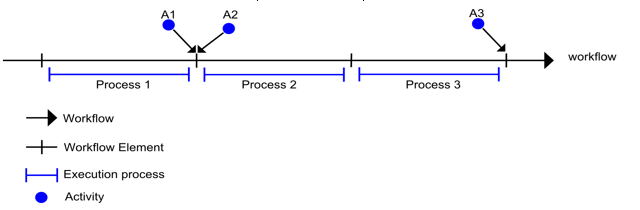
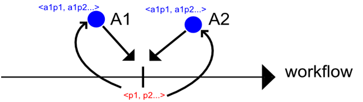

# Cadence

## Objectives
This project defines an architecture to insert specific actions in an execution process. Cadence uses
the Eclipse architecture profits by exploiting the concept of plug-in.

### General Schema
The next schema shows an abstract description of the concepts introduced in Cadence.
 


This Cadence defines three important concepts:
* Workflow: a workflow is a process where several sub processes (p1, p2, …) are executed one after others;
* Workflow Element: a workflow element is a step in the workflow between a sub process and the next one;
* Activity: an activity is an independent program that can be launch between to subprocesses, i.e. at a workflow element.

### Workflow Element and Activity

In this schema we zoom on the workflow element and introduce the concept of parameters. The parameters in red are defined by the workflow element. All the activities that contribute for this workflow element receive these parameters. For instance a parameter could be a semantic model and an activity could be implemented to test and validate the model before another sub process execution. Obviously the activity can access to the semantic model and the workflow element has to declare it as a parameter.
Each activity may define its own parameters, represented in blue on the previous schema. These parameters are also defined for the activity.

## Interfaces

### CadenceLauncher
Allows launching Cadence programmatically.
It's this class that your process should call in order to execute cadence. 

Provided by bundle:org.polarsys.kitalpha.cadence.core

File name: [org.polarsys.kitalpha.cadence.core.api.CadenceLauncher.java](https://github.com/eclipse/kitalpha/tree/master/cadence/plugins/org.polarsys.kitalpha.cadence.core/src/org/polarsys/kitalpha/cadence/core/api)

### CadenceRegistry
This class allows getting activities, workflows, etc... contributing at the Cadence extensions points.

Provided by bundle:org.polarsys.kitalpha.cadence.core

File name:[org.polarsys.kitalpha.cadence.api.CadenceRegistry.java](https://github.com/eclipse/kitalpha/blob/master/cadence/plugins/org.polarsys.kitalpha.cadence.core/src/org/polarsys/kitalpha/cadence/core/api/CadenceRegistry.java)

### CadenceUIRegistry
This class allows to launch a Cadence execution from the Eclipse UI or to get the Map of activities.

Provided by bundle:org.polarsys.kitalpha.cadence.ui

File name: [org.polarsys.kitalpha.cadence.ui.api.CadenceUIRegistry.java](https://github.com/eclipse/kitalpha/blob/master/cadence/plugins/org.polarsys.kitalpha.cadence.ui/src/org/polarsys/kitalpha/cadence/ui/api/CadenceUiRegistry.java)

### CadenceTab
This class extends AbstractLaunchConfigurationTab and allows providing a tab for the Launch Configuration UI eclipse mechanism.

Provided by bundle:org.polarsys.kitalpha.cadence.ui

File name: [org.polarsys.kitalpha.cadence.ui.api.CadenceTab.java](https://github.com/eclipse/kitalpha/blob/master/cadence/plugins/org.polarsys.kitalpha.cadence.ui/src/org/polarsys/kitalpha/cadence/ui/api/CadenceTab.java)

## Extensibility
Cadence is an Eclipse plug-in that defined two extension points:
* Workflow extension point: permits to define a workflow and its workflow elements ;
* Activity extension point: permits to define activity related to a workflow element.

A program is identified as a workflow if it can be divided in sub processes. a workflow can define many Workflow elements. Many activities can be defined for one workflow element and an activity can be defined for several workflow elements.

### Contributing a Workflow to a Process
Provided by bundle:org.polarsys.kitalpha.cadence.core

Extension point name: [org.polarsys.kitalpha.cadence.workflow.declaration](https://github.com/eclipse/kitalpha/blob/master/cadence/plugins/org.polarsys.kitalpha.cadence.core/schema/org.polarsys.kitalpha.cadence.workflow.declaration.exsd).

Contributing a workflow to a process is done through the following extension (in the bundle plugin.xml file):

```
<extension
         point="org.polarsys.kitalpha.cadence.core.workflow.declaration">
      <WorkflowDefinition
            Identifier="org.polarsys.kitalpha.example.workflow.definition"
            Name="Cadence Workflow Declaration Example">
         <Description>
           Description body text
         </Description>
         <WorkflowElement
               AllowMultipleContributions="true"
               Identifier="org.polarsys.kitalpha.example.workflow.element.definition"
               Name="Workflow Element 1"
               orderNumber="0">
            <Description>
               Description body text
            </Description>
            <ParameterDefinition
                  Name="Parameter 1"
                  Type="test.ParameterDefinition1">
               <Description>
                  Description body text
               </Description>
            </ParameterDefinition>
         </WorkflowElement>
      </WorkflowDefinition>
   </extension>
```

Only one workflow can be defined per extension.  

Worflow Declaration Attributes:
* `identifier`:	The ID of the workflow. (mandatory)
* `name`:	The Name of the Worflow. (mandatory)
* `description`:	A quick description for users about the workflow. (optional)

Workflow Element Declaration Attributes: 
* `identifier`:	The ID of the WorkflowElement. (mandatory)
* `name`:	The Name of the WorflowElement. (mandatory)
* `description`:	A quick description for users about the workflowElement. 
* `orderNumber`:	This attribute allows to sort WorkFlowElements by order.

ParameterDefinitionAttributes:
* `name`:	The Name of the Workflow. (mandatory)
* `description`:	A quick description for users about the workflow. (optional)
* `type`:	The type of the declared parameter (String, List&ltEObject&gt;, etc...)

### Contributing Activity to a Workflow

Provided by bundle: org.polarsys.kitalpha.cadence.core

Extension point name: [org.polarsys.kitalpha.cadence.core.activity.declaration](https://github.com/eclipse/kitalpha/blob/master/cadence/plugins/org.polarsys.kitalpha.cadence.core/schema/org.polarsys.kitalpha.cadence.activity.declaration.exsd).
Contributing an activity to a workflow is done through the following extension (in the bundle plugin.xml file):

```
<extension
   point="org.polarsys.kitalpha.cadence.core.activity.declaration">
    <ActivityDeclaration
      Identifier="org.polarsys.kitalpha.example.activity.contribution"
      Multiple="false"
      Name="My Contributed Activity"
      ActivityClass="org.polarsys.kitalpha.example.activity.MyActivity"
      WorkflowElementIdentifier="org.polarsys.kitalpha.example.workflow.element.definition"
      WorkflowIdentifier="org.polarsys.kitalpha.example.workflow.definition">
      <Description>
          Description body text
      </Description>
   </ActivityDeclaration>
</extension>

```


Activity Declaration Attributes: 
* `Identifier`:	The ID of the Activity. (mandatory)
* `Name`:	The Name of the WorflowElement. (mandatory)
* `Description`:	A quick description for users about the workflowElement. 
* `Multiple`	
* `WorkflowIdentifier`:	The ID of the contributed Workflow
* `WorkflowElementIdentifier`:	The ID of the contributed WorkflowElement
* `ActivityClass`:	The JAVA Class of the Activity (implements IActivity, see below)

#### API
This interface specifies the contract for providing activity.

Provided by bundle:org.polarsys.kitalpha.cadence.core

File name: [org.polarsys.kitalpha.cadence.core.api.IActivity.java](https://github.com/eclipse/kitalpha/blob/master/cadence/plugins/org.polarsys.kitalpha.cadence.core/src/org/polarsys/kitalpha/cadence/core/api/IActivity.java)
 

## Presentation

Additional documentation can be found on the [presentation](https://raw.githubusercontent.com/wiki/eclipse/kitalpha/pdf/Kitalpha-CTK-TR-Cadence.pdf).


