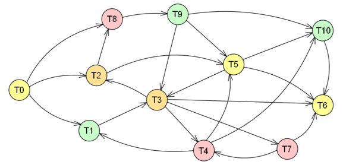
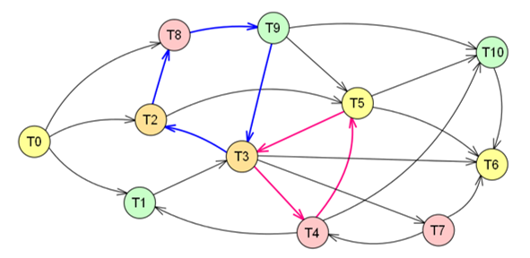
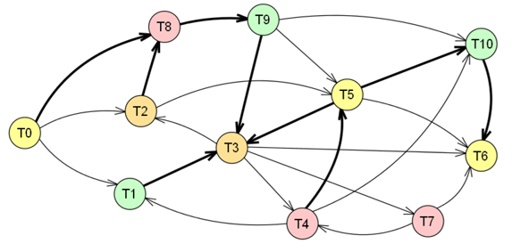
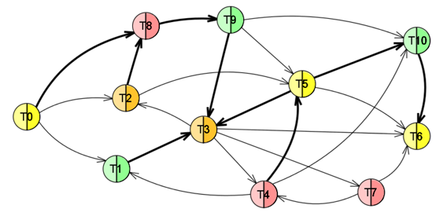
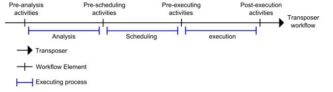

# Transposer
## Objectives
This project defines a generic and agnostic rule application tool. It is designed to be able to discover, infer and schedule application of provided rules. It can do model transformation, when applying transformation rules, other purposes may be impact analysis or model validation.
Mostly, Transposer is useful where the application is a set of tasks to be done.

For each category of tasks, you will need to defined a 'rule' that will handle the task:
* Yellow rule will perform tasks T0, T5, T6
* Green rule will perform tasks T1, T9, T10
* Orange will perform tasks T2, T3
* Red will perform tasks T7, T8, T4

Define tasks dependencies (or 'premices')

And Transposer will find a way to perform all tasks according to dependencies

In the above sample, Task T6 will be the first to be performed (no dependency to others tasks), then after, T10, T4, ... after ? Transposer will find a way to execute the tasks.

#### Cycle management

When tasks have cycle dependencies, it will determine an order to be performed first.

* Between T8, T9, T3, T2
* Between T3, T4, T5

There is 2 mechanisms for cycle resolution, `Critical dependencies vs dependencies`, as some dependencies can be considered as "more critical" than others, and `Complete and Incomplete rules`

**Critical dependencies vs dependencies**

* T3, T9, T8, T2 will be performed as incomplete
* Then, T3, T9, T8 and T2 will be performed as complete

**Complete and Incomplete rules**

The triggered order of tasks can be order can be
* T6, T10 complete only (no cycle, no problem)
* T3, T9, T8, T2, T1, T5, T4, T7, incomplete 
* T3, T9, T8, T2, T1, T5, T4, T7 complete
* T0 complete 

## Interfaces
Transposer provides some Services allowing to call/manipulate it.

### TransposerLauncher

This class allows launching programmatically a complete transposer's process.

Provided by bundle: org.polarsys.kitalpha.transposer.core

File name: [org.polarsys.kitalpha.transposer.api.TransposerLauncher.java](https://github.com/eclipse/kitalpha/blob/master/transposer/plugins/org.polarsys.kitalpha.transposer.core/src/org/polarsys/kitalpha/transposer/api/TransposerLauncher.java)

### TransposerConfiguration

This class define cadence activities used for each Transposer Workflow Elements.

Provided by bundle: org.polrsys.kitalpha.transposer.core

File name: [org.polarsys.kitalpha.transposer.api.TransposerConfiguration.java](https://github.com/eclipse/kitalpha/blob/master/transposer/plugins/org.polarsys.kitalpha.transposer.core/src/org/polarsys/kitalpha/transposer/api/TransposerConfiguration.java)

## Extensibility
Transposer is an Eclipse plug-in that defined one extension point:
* Declares mapping: to define a new mapping for transformation which holds the mappings between rules and their meta classes of the inputted model.
* Bindings extension point: permits to bind a semantic metamodel to an allocation metamodel.
* Strategy extension point: permits to create an allocation model from a semantic model.
* Refinery extension point: permits to refine an allocation model with additional information. a refinery is specific to an allocation metamodel. The refinery does the clever work.
* Generators extension point: permits to contribute an entry point for a code generator in order to know itself from the code generator manager.

### TransposerWorkflow
Transposer uses Cadence to manage external activities. Four workflow elements are declared:
* Pre Analysis,
* Pre Scheduling,
* Pre Execution,
* Post Execution.

Transposer Core declares the workflows and asks Cadence to run user-enabled external activities:

 

#### ITransposerWorkflow

This interface provides all Cadence IDs for each Workflow Elements and theirs parameters.
 
Provided by bundle: org.polarsys.kitalpha.transposer.core

File name: [org.polarsys.kitalpha.transposer.api.ITransposerWorkflow.java](https://github.com/eclipse/kitalpha/blob/master/transposer/plugins/org.polarsys.kitalpha.transposer.core/src/org/polarsys/kitalpha/transposer/api/ITransposerWorkflow.java)

### Customising The The Transposer Behaviour
Transposer provides main interfaces allowing to contribute / redefine the behaviour of Transposer.

### ITransposer
This interface allows contributing a new Transposer Process using the Transposer Architecture.

Provided by bundle: org.polarsys.kitlpha.transposer.core

File name: [org.polarsys.kitalpha.transposer.api.ITransposer.java](https://github.com/eclipse/kitalpha/blob/master/transposer/plugins/org.polarsys.kitalpha.transposer.core/src/org/polarsys/kitalpha/transposer/api/ITransposer.java)

### IScheduler
This interface defines objects allowing to de schedule rule application thanks to the dependency graph.

Provided by bundle: org.polarsys.kitalpha.transposer.scheduler

File name: [org.polarsys.kitalpha.transposer.scheduler.api.IScheduler.java](https://github.com/eclipse/kitalpha/blob/master/transposer/plugins/org.polarsys.kitalpha.transposer.scheduler/src/org/polarsys/kitalpha/transposer/scheduler/api/IScheduler.java)

### IRuleHandler
This interface defines objects are responsible for rule discovery and rule inference.

Provided by bundle: org.polarsys.kitalpha.transposer.rules.handler

File name: [org.polarsys.kitalpha.transposer.rules.handler.api.IRuleHandler.java](https://github.com/eclipse/kitalpha/blob/master/transposer/plugins/org.polarsys.kitalpha.transposer.rules.handler/src/org/polarsys/kitalpha/transposer/rules/handler/api/IRulesHandler.java)

### ITransposerTask
This interface defines Transposer tasks objects.

Provided by bundle: org.polarsys.kitalpha.transposer.scheduler

File name: [org.polarsys.kitalpha.transposer.scheduler.api.ITransposerTask.java](https://github.com/eclipse/kitalpha/blob/master/transposer/plugins/org.polarsys.kitalpha.transposer.scheduler/src/org/polarsys/kitalpha/transposer/scheduler/api/ITransposerTask.java)

### Contributing a Set Of Rules to Transposer

Provided by bundle: org.polarsys.kitalpha.transposer.core

Extension point name: [org.polarsys.kitalpha.transposer.rules.handler.mapping](https://github.com/eclipse/kitalpha/blob/master/transposer/plugins/org.polarsys.kitalpha.transposer.rules.handler/schema/mapping.exsd).

Contributing a set of rules is done through the following extension (in the bundle plugin.xml file). 
You can show below the extension point description: 

 
Extension Declaration Attributes: 
* `Id`:	The ID of the Transposer contribution. (mandatory)
* `Name`:	The Name of the Transposer contribution.

Mapping Declaration Attributes:
* `MappingPurpose`:	The purpose of the Mapping. (mandatory)
* `MappingName`:	The Name of the Mapping.
* `Description`:	A quick description for users.
* `Private`:	Allows to hide the mapping in the User Interface
* `ExtendedMappingExtensionID`:	The extended Transposer Mapping by this one.
* `DomainHelper`:	The Domain Helper class used by this mapping.
* `Context`:	The Context class used by this mapping. If not provided then it's the GenericContext class that will be used.

MappingPackage Declaration Attributes:
* `Name`:	The name of the MappingPackage. (mandatory)

MappingElement Declaration Attributes:
* `Name`:	The Name of the Mapping. (mandatory)
* `ReuseExtendedElementDefaultPossibility`:	Defines if this MappingElement should reuse the DefaultPossibility definition extended by this one.
* `ReuseExtendedElementPossibilities`:	Defines if this MappingElement should reuse the Possibilities definition extended by this one.
* `DomainMetaClass`:	The domain class.

DefaultMappingPossibility or MappingPossibility Declaration Attributes:
* `Enabled`:	Define if the rule should enable or not. By default TRUE.
* `Name`:	The Name of the DefaultMappingPossiblity element.
* `CompleteRule`:	The standard rule to be used when no cycles occur on the model element we want to transpose.
* `IncompleteRule`:	Rule to be used when cycles occurs. During model transformation, it allows continuing the process by creating a "stake holder" element, and the engine will "fill" this element at the end of the transformation.

Context	May declare a local IContext that will complete the current one when this rule is executed. This IContext will "help" the rule do the job (cache queries results ...).

#### APIs
#####	IRule Interface

This interface specifies the contract for a Rule (complete or incomplete).

Provided by bundle: org.polarsys.kitalpha.transposer.rules.handler

File name: [org.polarsys.kitalpha.transposer.rules.handler.rules.api.IRule.java](https://github.com/eclipse/kitalpha/blob/master/transposer/plugins/org.polarsys.kitalpha.transposer.rules.handler/src/org/polarsys/kitalpha/transposer/rules/handler/rules/api/IRule.java)

#####	IDomainHelper Interface

Provided by bundle: org.polarsys.kitalpha.transposer.rules.handler

File name: [org.polarsys.kitalpha.transposer.rules.handler.rules.api.IDomainhelper.java](https://github.com/eclipse/kitalpha/blob/master/transposer/plugins/org.polarsys.kitalpha.transposer.rules.handler/src/org/polarsys/kitalpha/transposer/rules/handler/rules/api/IDomainHelper.java)

## Presentation

Additional documentation can be found on the [presentation](https://raw.githubusercontent.com/wiki/eclipse/kitalpha/pdf/Kitalpha-CTK-TR-Transposer.pdf).

